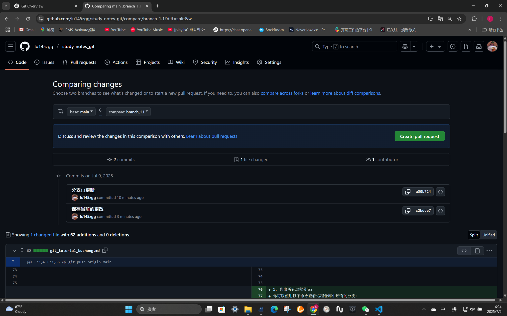
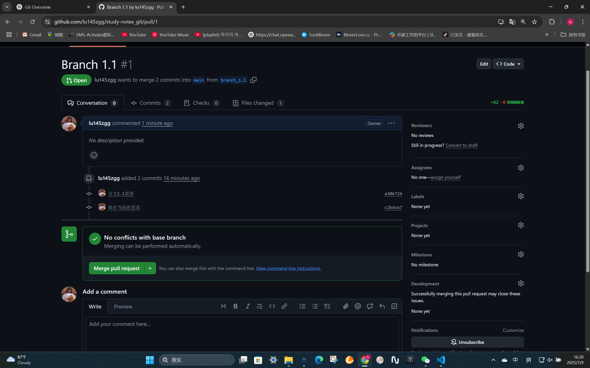
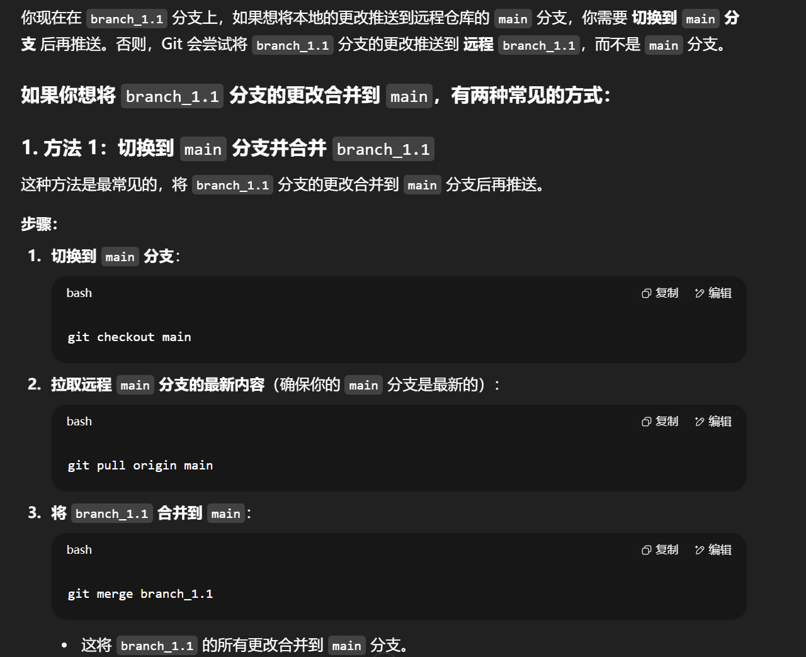
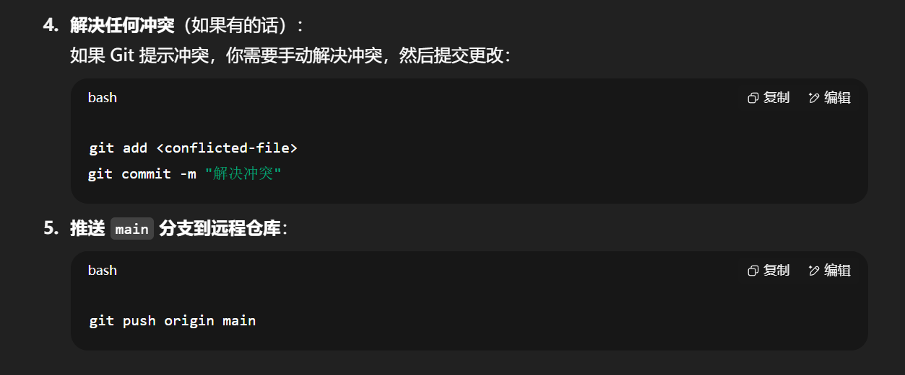
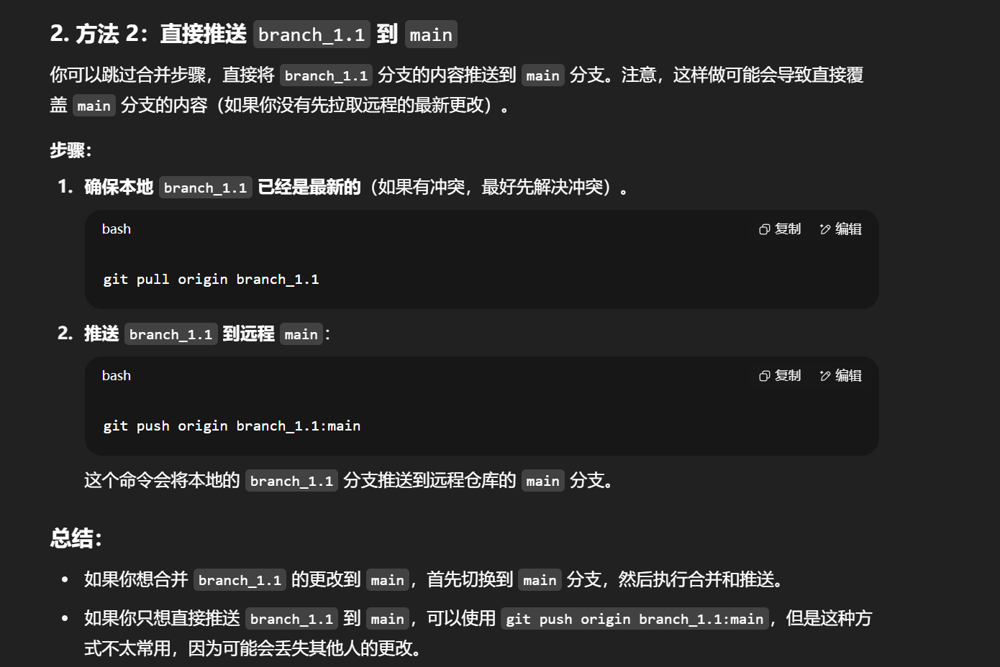

# Git 多人协作与冲突解决教程

## 1. 多人协作的工作流程

### 基本流程：
1. **克隆仓库**：
   每个开发者将远程仓库克隆到本地：
   ```bash
   git clone https://github.com/username/repository.git
   ```

2. **创建分支**：
   为了避免直接在 `main` 分支上工作，开发者通常会为每个任务创建一个新的分支：
   ```bash
   git checkout -b feature-branch
   ```
   这会创建一个新的分支 `feature-branch`，并切换到这个分支。

3. **开发和提交**：
   在自己的分支上进行开发，修改代码并提交：
   ```bash
   git add .
   git commit -m "描述本次更改"
   ```

4. **拉取最新的远程更新**：
   在提交前，最好先从远程仓库拉取最新的更新，确保自己本地的分支是最新的：
   ```bash
   git pull origin main
   ```

5. **推送更改**：
   当开发完成后，将自己的分支推送到远程仓库：
   ```bash
   git push origin feature-branch
   ```

6. **发起 Pull Request**：
   在 GitHub 或其他 Git 托管平台上，开发者可以将自己的分支提交为 **Pull Request**（PR）。PR 允许其他开发者审查代码，并将其合并到 `main` 分支。


7. **审查和合并**：
   审查代码后，开发者会将其合并到 `main` 分支。

---

## 2. 处理 Git 冲突

### 冲突发生的常见情景：
1. **合并冲突（Merge Conflict）**：
   当你在本地修改了某个文件，并且在推送之前，另一个开发者已经对同一个文件进行了修改并推送到远程仓库。此时，Git 会提示合并冲突。

2. **拉取远程更改时的冲突**：
   当你执行 `git pull` 时，如果你本地的更改和远程的更改发生冲突，Git 会显示冲突并要求手动解决。

### 处理冲突的步骤：

1. **拉取远程更改并检查冲突**：
   当你执行 `git pull` 或 `git merge` 时，Git 会告诉你哪些文件有冲突。
   ```bash
   git pull origin main
   ```

   如果文件有冲突，Git 会显示类似如下的消息：
   ```bash
   Auto-merging file1.txt
   CONFLICT (content): Merge conflict in file1.txt
   ```

2. **检查冲突文件**：
   Git 会在冲突的文件中插入特殊标记，类似于：
   ```plaintext
   <<<<<<< HEAD
   这是你本地的更改
   =======
   这是远程仓库的更改
   >>>>>>> origin/main
   ```

3. **解决冲突**：
   打开冲突的文件并手动解决冲突。通常有三种方式：
   - **保留本地更改**：删除 `=======` 和 `>>>>>>>` 之后的内容，保留你本地的更改。
   - **保留远程更改**：删除 `<<<<<<<` 和 `=======` 之前的内容，只保留远程的更改。
   - **合并两者**：如果需要，可以将本地和远程的内容合并，确保最终文件能正常工作。

4. **标记冲突已解决**：
   解决冲突并保存文件后，运行以下命令来标记文件冲突已解决：
   ```bash
   git add <conflicted-file>
   ```

5. **提交合并结果**：
   当所有冲突解决并添加到暂存区后，你需要提交合并的结果：
   ```bash
   git commit -m "Resolved merge conflict"
   ```

6. **推送到远程仓库**：
   解决冲突并提交之后，推送更改到远程仓库：
   ```bash
   git push origin main
   ```

---

## 3. 防止冲突的最佳实践

1. **频繁拉取和推送**：
   - 经常使用 `git pull` 拉取远程仓库的最新更改，并尽早推送本地的更改。这样可以减少长时间保持分支与主分支不一致导致的冲突。

2. **小而频繁的提交**：
   - 保持每次提交的范围小，避免大规模的、更改多个文件的提交。这样在合并时会更容易解决冲突。

3. **使用分支**：
   - 始终在单独的分支上开发新功能或修复 Bug。这样，冲突只会发生在合并时，而不是在多人开发的过程中。

4. **沟通**：
   - 多人与团队协作时，沟通非常重要。确保每个人都清楚谁在修改什么内容，减少对同一部分代码的编辑。

---

## 4. 其他工具帮助解决冲突

1. **Git GUI 工具**：像 **GitHub Desktop**、**Sourcetree** 等 GUI 工具可以更直观地展示冲突，帮助你快速解决冲突。
2. **VS Code**：VS Code 有内置的 Git 工具，可以帮助你更方便地查看冲突，并提供图形界面来选择保留的内容。

---

## 总结

- **多人协作**：通过分支、频繁拉取推送、PR（Pull Request）等方式进行协作。
- **冲突解决**：当 Git 无法自动合并时，你需要手动编辑冲突文件，解决冲突后提交并推送。
- **预防冲突**：保持频繁的拉取和推送，避免长时间停留在不更新的分支上。





