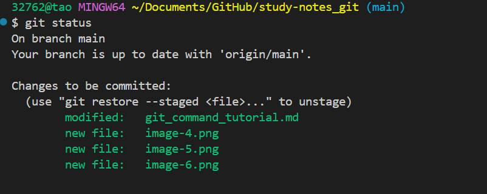
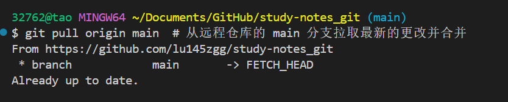

# Git 常用命令及语法详细教程

## 1. `git status`

### 作用：

`git status` 用来查看当前工作目录和暂存区的状态。它显示哪些文件被修改，哪些文件已经添加到暂存区，哪些文件还没有被 Git 跟踪。

### 语法：

```bash
git status
```

### 输出示例：

* **Untracked files**：这些文件是 Git 没有跟踪的文件。
* **Changes not staged for commit**：这些文件已修改，但没有加入到暂存区（还没有准备提交）。
* **Changes to be committed**：这些文件已加入暂存区，准备提交。

### 例子：

```bash
git status
```

输出：

```bash
On branch main
Your branch is up to date with 'origin/main'.

Changes not staged for commit:
  (use "git add <file>..." to update what will be committed)
        modified:   git_learn.md

no changes added to commit (use "git add" and/or "git commit -a")
```

---

## 2. `git add`

### 作用：

`git add` 用于将工作目录中的更改添加到暂存区，使其准备好进行提交。可以选择性地将文件添加到暂存区，或者将所有文件添加进去。

### 语法：

```bash
git add <file-name>  # 添加单个文件
git add .  # 添加当前目录下所有更改的文件
```

### 用法：

* **`git add <file-name>`**：将某个文件添加到暂存区。
* **`git add .`**：将当前目录下所有已修改或新创建的文件添加到暂存区。

### 示例：

```bash
git add git_learn.md  # 将 git_learn.md 文件添加到暂存区
```

或者：

```bash
git add .  # 将当前目录下的所有文件（包括新文件和修改过的文件）添加到暂存区
```


---

## 3. `git commit`

### 作用：

`git commit` 用于将暂存区的更改提交到本地仓库。每次提交都会生成一个唯一的提交 ID，并附带提交信息，记录这次提交的目的。

### 语法：

```bash
git commit -m "<commit message>"
```

* **`-m "<commit message>"`**：为提交添加一个简短的描述信息。

### 示例：

```bash
git commit -m "Fixed typo in the git_learn.md file"
```

这会将 `git add` 阶段准备好的文件提交到 Git 本地仓库，并附带提交信息 `"Fixed typo in the git_learn.md file"`。

### 提交信息规范：

* 提交信息应该简短且具有描述性。通常：

  * 第一行简短概括更改内容（50 字以内）。
  * 第二行留空。
  * 后续几行可以详细说明本次更改的背景和影响。

---

## 4. `git push`

### 作用：

`git push` 用于将本地仓库中的提交推送到远程仓库。远程仓库可以是 GitHub、GitLab 或其他 Git 托管平台。

### 语法：

```bash
git push origin <branch-name>
```

* **`origin`**：远程仓库的默认名称。
* **`<branch-name>`**：想推送的本地分支（如 `main` 或 `master`）。

### 示例：

```bash
git push origin main  # 将本地的 main 分支推送到远程仓库
```

### 说明：

* 第一次推送分支，Git 会要求输入 GitHub 或其他平台的用户名和密码。
* 使用 SSH 方式配置远程仓库，Git 将自动使用 SSH 密钥进行身份验证。

---

## 5. `git pull`

### 作用：

`git pull` 用于从远程仓库获取最新的更改，并合并到当前分支。它相当于执行了 `git fetch` 和 `git merge` 两个命令。

### 语法：

```bash
git pull origin <branch-name>
```

* **`origin`**：远程仓库的名称。
* **`<branch-name>`**：远程分支的名称（如 `main`）。

### 示例：

```bash
git pull origin main  # 从远程仓库的 main 分支拉取最新的更改并合并
```

---

## 6. `git log`

### 作用：

`git log` 用于查看 Git 仓库的提交历史。它列出每次提交的 SHA 哈希、提交人、提交日期和提交信息。

### 语法：

```bash
git log
```

### 示例：

```bash
git log
```

输出示例：

```bash
commit 1234567890abcdef
Author: Your Name <youremail@example.com>
Date:   Mon Jul 5 14:10:23 2021 +0000

    Fixed typo in the git_learn.md file
```

---

## 7. `git remote add`

### 作用：

`git remote add` 用于将远程仓库与本地仓库关联。通常在你第一次克隆一个仓库，或者需要将本地仓库与远程仓库连接时使用。

### 语法：

```bash
git remote add origin <repository-url>
```

* **`origin`**：远程仓库的名称，默认是 `origin`。
* **`<repository-url>`**：远程仓库的 URL 地址，通常是 GitHub、GitLab 等平台提供的地址。

### 示例：

```bash
git remote add origin https://github.com/yourusername/yourrepository.git
```

---

## 8. `git restore`

### 作用：

`git restore` 用于恢复文件的内容，丢弃未暂存的更改。它可以让你恢复文件到上一个提交时的状态。

### 语法：

```bash
git restore <file-name>
```

### 示例：

```bash
git restore git_learn.md  # 恢复 git_learn.md 文件到上次提交时的状态
```

---

## 总结：

* **`git add`**：将修改的文件添加到暂存区。
* **`git commit`**：将暂存区的文件提交到本地仓库。
* **`git push`**：将本地仓库的提交推送到远程仓库。
* **`git pull`**：从远程仓库拉取最新的更改并合并到本地。
* **`git status`**：查看当前仓库的状态，哪些文件修改了、哪些文件尚未添加到暂存区。
* **`git log`**：查看提交历史。
* **`git restore`**：恢复文件到上次提交时的状态，丢弃未暂存的更改。


