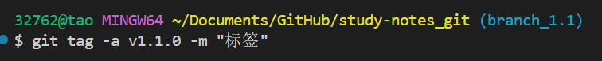

是的，你记得没错！**GitHub Desktop** 可以自动帮助你将本地仓库与 GitHub 上的远程仓库关联，并且在 VS Code 启动时自动配置 Git。如果你使用的是 **GitHub Desktop** 并且配置了仓库，它会在后台完成很多操作，包括远程仓库的关联。

### 通过 GitHub Desktop 自动关联仓库的流程：

1. **克隆仓库**：
   在 GitHub Desktop 中，你可以选择将 GitHub 上的仓库克隆到本地。当你通过 GitHub Desktop 克隆仓库时，GitHub Desktop 会自动将本地仓库与远程仓库（GitHub 上的仓库）关联。

2. **使用 VS Code 打开仓库**：

   * 如果你使用 GitHub Desktop 打开仓库，它会自动配置 VS Code 作为默认编辑器。
   * 打开项目时，GitHub Desktop 会自动加载仓库信息并配置 Git 相关设置，包括远程仓库。

3. **自动配置远程仓库**：
   GitHub Desktop 会自动使用正确的 **远程仓库 URL**，并且每次你通过 GitHub Desktop 推送更改时，它会自动推送到你在 GitHub 上的仓库。

### 在 VS Code 中使用 Git：

* 如果你已经通过 GitHub Desktop 克隆仓库，打开 VS Code 后，它会自动加载仓库的 Git 配置。
* 在 VS Code 中，你可以直接使用 **Source Control** 面板来管理 Git 操作，如提交更改、查看差异、推送到远程仓库等。

### 如果想确保远程仓库已正确关联：

1. 打开 VS Code，确保你打开的是已通过 GitHub Desktop 克隆的项目。
2. 打开 **Terminal** 或 **VS Code 集成终端**。
3. 运行以下命令来检查远程仓库：

   ```bash
   git remote -v
   ```

   如果输出显示了正确的仓库 URL（如 `https://github.com/lu145zgg/study-notes_git.git`），说明远程仓库已正确关联。

### 如果没有看到远程仓库的 URL：

你可以手动将远程仓库与本地仓库关联（如上面之前提到的 `git remote set-url` 命令）。

### 总结：

* **GitHub Desktop** 确实可以自动帮助你关联本地仓库与远程仓库，且在你打开 VS Code 时，它会自动配置 Git。
* 如果你不确定是否已正确关联远程仓库，可以通过 `git remote -v` 命令检查远程仓库配置。

1. 检查远程仓库配置
首先，你可以运行以下命令来检查当前的远程仓库设置：

bash
复制
编辑
git remote -v
如果你看到类似如下的输出：

bash
复制
编辑
origin  https://github.com/lu145zgg/study-notes_git.git (fetch)
origin  https://github.com/lu145zgg/study-notes_git.git (push)
说明远程仓库已经配置好了，你可以跳过下一步。

2. 设置远程仓库 URL（如果没有配置）
如果远程仓库 URL 没有正确配置，或者需要重新配置，你可以使用以下命令来设置远程仓库 URL：

bash
复制
编辑
git remote set-url origin https://github.com/lu145zgg/study-notes_git.git
3. 推送更改到 GitHub
然后，你可以使用 git push 将本地的更改推送到远程仓库：

bash
复制
编辑
git push origin main
如果你使用 HTTPS 链接，Git 可能会要求你输入 GitHub 的用户名和密码。为了提高安全性，建议使用 GitHub 个人访问令牌（PAT） 来替代密码进行身份验证。


1. 列出所有远程分支：
你可以使用以下命令查看远程仓库中所有的分支：

bash
复制
编辑
git branch -r
这将列出所有远程分支，比如：

bash
复制
编辑
origin/main
origin/branch_1.1
origin/branch_1.2
2. 切换到远程分支：
如果你想切换到其中一个远程分支（比如 branch_1.1），你可以运行：

bash
复制
编辑
git checkout branch_1.1
这会将你的工作目录切换到 branch_1.1 分支。注意，默认情况下，Git 会在本地创建一个跟踪分支与远程分支同步。

3. 拉取并合并远程分支的更改：
如果你想将这些新分支的内容合并到当前分支，可以使用：

bash
复制
编辑
git merge origin/branch_1.1
git merge origin/branch_1.2
这样可以将远程的 branch_1.1 和 branch_1.2 分支合并到你的当前分支（例如 main）中。

4. 删除不再需要的远程分支（如果这些分支不再使用）：
如果你不再需要这些分支，使用以下命令删除远程分支：

bash
复制
编辑
git push origin --delete branch_1.1
git push origin --delete branch_1.2
总结：
git pull 拉取了远程仓库的最新内容，发现了新的远程分支（branch_1.1 和 branch_1.2），但是没有需要合并的更改到你的 main 分支。


### 注意！！！！！！！


git add git_tutorial_buchong.md
git commit -m "保存当前的更改"

git checkout main


git stash
git stash pop


git checkout -- git_tutorial_buchong.md
git checkout main


`git tag` 是 Git 中用于 **创建标签（tag）** 的命令。标签通常用于标记某个特定的提交，通常用于标记发布版本（如 `v1.0`、`v2.0` 等）。

### `git tag` 命令的基本用法：

标签在 Git 中是用于为特定的提交添加 **版本标识**，帮助你轻松标记发布版本、里程碑或任何重要的提交。

### 1. **列出所有标签**

使用 `git tag` 可以列出当前仓库中所有的标签。

```bash
git tag
```

这将显示所有标签名称的列表。

### 2. **创建标签**

创建标签有两种方式：**轻量标签（lightweight tag）** 和 **注释标签（annotated tag）**。

#### 轻量标签（Lightweight Tag）

轻量标签其实只是对某个提交的一个指针，它不包含其他信息（如标签作者、日期、说明等）。

```bash
git tag <tag-name>
```

例如，创建一个名为 `v1.0` 的标签：

```bash
git tag v1.0
```

#### 注释标签（Annotated Tag）

注释标签是 Git 推荐的标签类型，它会包含更多的信息，如标签创建者、日期和标签说明等。

```bash
git tag -a <tag-name> -m "Tag description"
```

例如，创建一个带有说明的 `v1.0` 标签：

```bash
git tag -a v1.0 -m "Initial release"
```

`-a` 用于指定标签为注释标签，`-m` 后跟的是标签的描述。

### 3. **查看标签信息**

使用 `git show <tag-name>` 可以查看某个标签的详细信息，包括标签指向的提交内容。

```bash
git show v1.0
```

### 4. **推送标签到远程仓库**

默认情况下，Git 标签不会自动推送到远程仓库，需要显式地推送标签。

* **推送单个标签**：

  ```bash
  git push origin <tag-name>
  ```

  例如：

  ```bash
  git push origin v1.0
  ```

* **推送所有标签**：
  如果你想将所有本地标签推送到远程仓库，可以使用：

  ```bash
  git push --tags
  ```

### 5. **删除标签**

* **删除本地标签**：

  ```bash
  git tag -d <tag-name>
  ```

  例如：

  ```bash
  git tag -d v1.0
  ```

* **删除远程标签**：
  如果你想删除远程仓库中的标签，首先删除本地标签，然后推送删除操作到远程仓库：

  ```bash
  git push --delete origin <tag-name>
  ```

### 6. **标签常见用途**

* **版本标记**：标签常用于标记版本发布。例如，标记 `v1.0` 为第一个正式发布版本。
* **重要的提交**：可以在重要的提交处创建标签，方便日后查看和回溯。
* **发布点**：在项目发布时，可以创建标签来表示某个特定的发布点。

### 示例：

假设你正在开发一个软件项目，并且已经完成了第一个版本的开发。你可以使用标签标记该版本：

```bash
git tag -a v1.0 -m "First stable release"
```

然后将标签推送到远程仓库：

```bash
git push origin v1.0
```

### 总结：

* **`git tag`** 用于创建、查看和管理标签，通常用于标记特定的提交。
* **轻量标签**是简单的指向某个提交的标记，而**注释标签**则包含更多信息，适用于标记发布版本。
* 标签需要显式地推送到远程仓库，默认情况下不会自动推送。



